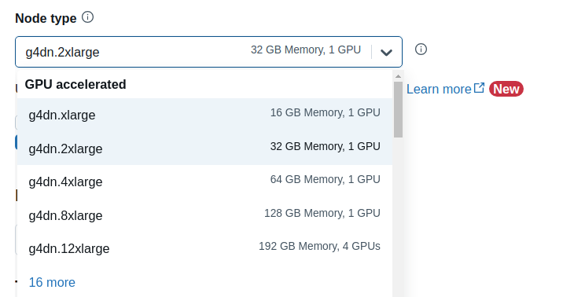
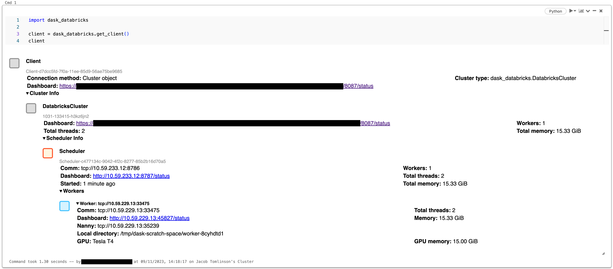

# Databricks

You can install RAPIDS on Databricks in a few different ways:

1. Accelerate machine learning workflows in a single-node GPU notebook environment
2. Spark users can install [RAPIDS Accelerator for Apache Spark 3.x on Databricks](https://docs.nvidia.com/spark-rapids/user-guide/latest/getting-started/databricks.html)
3. Install Dask alongside Spark and then use libraries like `dask-cudf` for multi-node workloads

## Single-node GPU Notebook environment

(create-init-script)=

### Create init-script

To get started, you must first configure an [initialization script](https://docs.databricks.com/en/init-scripts/index.html) to install RAPIDS libraries and all other dependencies for your project.

Databricks recommends using [cluster-scoped](https://docs.databricks.com/en/init-scripts/cluster-scoped.html) init scripts stored in the workspace files.

Navigate to the top-left **Workspace** tab and click on your **Home** directory then select **Add** > **File** from the menu. Create an `init.sh` script with contents:

```bash
#!/bin/bash
set -e

# Install RAPIDS libraries
/databricks/python/bin/pip install \
    --extra-index-url=https://pypi.nvidia.com \
    cudf-cu12 \
    dask-cudf-cu12 \
    cuml-cu12 \
    dask-cuda=={rapids_version}
```

(launch-databricks-cluster)=

### Launch cluster

To get started with a single-node Databricks cluster, navigate to the **All Purpose Compute** tab of the **Compute** section in Databricks and select **Create Compute**. Name your cluster and choose "Single node".


In order to launch a GPU node uncheck **Use Photon Acceleration**.


The "GPU accelerated" nodes should be available in the **Node type** dropdown.



Then expand the **Advanced Options** section, open the **Init Scripts** tab and add the file path to the init-script in your Workspace directory starting with `/Users/<user-name>/<script-name>.sh`.


Select **Create Compute**

### Test RAPIDS

Once your cluster has started, you can create a new notebook or open an existing one from the `/Workspace` directory then attach it to your running cluster.

```python
import cudf

gdf = cudf.DataFrame({"a":[1,2,3],"b":[4,5,6]})
gdf
    a   b
0   1   4
1   2   5
2   3   6
```

## Multi-node Dask cluster

Dask now has a [dask-databricks](https://github.com/jacobtomlinson/dask-databricks) CLI tool (via [`conda`](https://github.com/conda-forge/dask-databricks-feedstock) and [`pip`](https://pypi.org/project/dask-databricks/)) to simplify the Dask cluster startup process within Databricks.

### Install RAPIDS and Dask

[Create the init script](create-init-script) below to install `dask`, `dask-databricks` RAPIDS libraries and all other dependencies for your project.

```bash
#!/bin/bash
set -e

# Install RAPIDS, dask-databricks and other dependencies.
/databricks/python/bin/pip install --extra-index-url=https://pypi.nvidia.com \
      cudf-cu12 \
      dask[complete] \
      dask-cudf-cu12  \
      dask-cuda=={rapids_version} \
      dask-databricks

# Start the Dask cluster with CUDA workers
dask databricks run --cuda

```

**Note**: By default, the `dask databricks run` command will launch a dask scheduler in the driver node and standard workers on remaining nodes.

To launch a dask cluster with GPU workers, you must parse in `--cuda` flag option.

### Launch Dask cluster

Once your script is ready, follow [instructions](launch-databricks-cluster) to launch a **Multi-node** Databricks cluster.

Now you should be able to select a "GPU-Accelerated" instance for both **Worker** and **Driver** nodes.


You can also configure cluster log delivery in the **Logging** tab, which will write the [init script logs](https://docs.databricks.com/en/init-scripts/logs.html) to DBFS in a subdirectory called `dbfs:/cluster-logs/<cluster-id>/init_scripts/`.

### Connect to Client

To test RAPIDS, Connect to the dask client and submit tasks.

```python
import dask_databricks


client = dask_databricks.get_client()
client
```

The **[Dask dashboard](https://docs.dask.org/en/latest/dashboard.html)** provides a web-based UI with visualizations and real-time information about the Dask cluster's status i.e task progress, resource utilization, etc.

The Dask dashboard server will start up automatically when the scheduler is created, and is hosted on ports `8087` by default.

To access, follow the provided URL link to the dashboard status endpoint from within Databricks.



```python
import cudf
import dask


df = dask.datasets.timeseries().map_partitions(cudf.from_pandas)
df.x.mean().compute()
```


### Clean up

```python
client.close()
```
